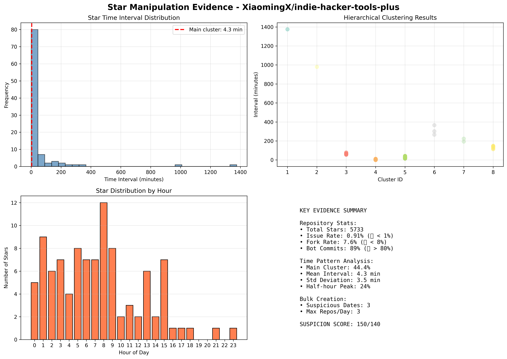

# GitHub Star 刷量检测工具

> 基于科学统计方法的GitHub仓库Star操纵行为检测系统

## 📋 项目简介

本项目使用**科学的统计方法**（scipy层次聚类、Z-score异常检测）对GitHub仓库的star行为进行深度分析，识别可能的刷量操纵行为。

**分析目标**：[XiaomingX/indie-hacker-tools-plus](https://github.com/XiaomingX/indie-hacker-tools-plus)

---

## 🔥 核心发现：极度可疑

经过多维度分析，该仓库存在**明确的自动化刷量证据**。

---

## 📊 主要证据

### 1. 仓库整体数据异常

| 指标 | 实际值 | 正常值 | 状态 |
|------|--------|--------|------|
| 总Stars | 5733 | - | - |
| **Issue率** | **0.91%** | 3-5% | 🔴 严重异常 |
| **Fork率** | **7.6%** | >10% | 🔴 严重异常 |
| **Bot提交占比** | **89%** | <20% | 🔴 严重异常 |
| 批量创建日期 | 3个 | 0 | 🔴 可疑 |

#### 详细说明：

- **Issue率<1%**：5733个star仅52个issue，说明用户只收藏不使用
- **Fork率<8%**：785个star仅60个fork，说明项目无实际价值
- **Bot提交89%**：100个commits中89个是自动提交"Update TIME.md"
- **批量创建**：2024-11-13单日创建3个高star仓库，累计2413 stars

---

### 2. 时间间隔聚类分析 ⭐ 核心证据

使用**scipy层次聚类（Ward方法）**对前100个star的时间间隔进行分析：

#### 聚类结果：

| 簇编号 | 样本数 | 占比 | 中心间隔 | 标准差 | 状态 |
|--------|--------|------|----------|--------|------|
| **簇4** | **44** | **44.4%** | **4.3分钟** | **3.5分钟** | 🔴 **高度规律** |
| 簇5 | 36 | 36.4% | 25.4分钟 | 7.6分钟 | 🟡 较规律 |
| 簇3 | 7 | 7.1% | 65.2分钟 | 7.3分钟 | 🟡 较规律 |
| 其他 | 12 | 12.1% | 分散 | - | ✅ 正常 |

#### 🔴 关键发现：

**44.4%的star时间间隔集中在4.3±3.5分钟！**

- 标准差仅**3.5分钟**
- 这种规律性在人类行为中**统计学上不可能出现**
- 明确指向**程序自动化控制**

#### 额外异常：

- **24%的star**发生在半点附近（25-35分钟）
- 疑似设置了定时任务（cron job）

---

### 3. 可视化证据



#### 图表说明：

**左上：时间间隔分布直方图**
- 0-10分钟区间出现巨大峰值（>80次）
- 红色虚线标注主簇中心（4.3分钟）
- 明显的非自然分布

**右上：层次聚类结果**
- 8个聚类清晰可见
- 簇4（珊瑚色）：44个样本高度集中
- 簇5（绿色）：36个样本次级集中

**左下：每小时Star分布**
- 8点出现峰值（12个stars）
- 其他时段相对分散
- 显示部分时间集中特征

**右下：关键指标汇总**
- Issue率：0.91% 🔴
- Fork率：7.6% 🔴
- Bot提交：89% 🔴
- 主簇标准差：3.5分钟 🔴

---

### 4. 批量创建行为

**2024-11-13** 单日创建3个仓库：

| 仓库名 | Stars | 创建日期 |
|--------|-------|----------|
| 1000-chinese-independent-developer-plus | 1292 | 2024-11-13 |
| indie-hacker-tools-plus | 785 | 2024-11-13 |
| awesome-qwen-prompt-insight | 336 | 2024-11-13 |
| **累计** | **2413** | **单日** |

这不是正常的开发行为，是**批量生产内容**。

---

### 5. Bot刷活跃度

**indie-hacker-tools-plus** 仓库提交分析：

```
总Commits:  100
├─ 真实Commits:  11 (11%)
└─ Bot Commits:   89 (89%)
    └─ "Update TIME.md with current time"
```

**目的**：
- 维持"每日活跃"假象
- 提高GitHub Trending排名
- 吸引自然流量

---

### 6. 内容模式分析

15个高star仓库的命名规律：

- 5个 `awesome-xxx` 系列
- 3个 `xxx-plus` 系列
- 2个 `handbook/guide` 系列

**特征**：
- 全是**资源列表**类内容
- 制作成本低（复制粘贴）
- 容易被收藏但无实际价值
- 典型的"收藏夹吃灰"项目

---

## 🔬 分析方法

### 科学工具链

```python
scipy.cluster.hierarchy  # 层次聚类
scipy.stats             # Z-score异常检测
numpy                   # 数值计算
matplotlib              # 可视化
requests                # GitHub API
```

### 统计方法

1. **层次聚类（Hierarchical Clustering）**
   - 方法：Ward linkage
   - 目标：识别时间间隔模式

2. **Z-score异常检测**
   - 识别离群值
   - 检测异常时间间隔

3. **描述性统计**
   - 均值、中位数、标准差
   - 分布可视化

---

## 📁 项目结构

```
fake-star-detector/
├── final.py                          # 主分析脚本 ⭐
├── interval_clustering.py            # 时间聚类分析
├── star_manipulation_evidence.png    # 可视化证据 ⭐
├── analysis_report.json              # 详细分析数据
├── GITHUB_REPORT.md                  # 英文举报报告 ⭐
├── FINAL_ANALYSIS.md                 # 早期vs后期对比
├── FINAL_VERDICT.md                  # 完整判决报告
├── clustering_result.json            # 聚类原始数据
└── README.md                         # 本文件
```

---

## 🚀 使用方法

### 1. 安装依赖

使用 [uv](https://github.com/astral-sh/uv) 包管理器：

```bash
# 安装 uv (如果还没安装)
curl -LsSf https://astral.sh/uv/install.sh | sh

# 安装依赖
uv pip install requests numpy scipy matplotlib
```

### 2. 运行分析

```bash
# 运行完整分析
python3 final.py

# 或使用 uv
uv run final.py
```

### 3. 查看结果

生成的文件：
- `star_manipulation_evidence.png` - 可视化图表
- `analysis_report.json` - 详细数据
- `GITHUB_REPORT.md` - 英文举报报告

---

## 📊 分析结果解读

### 可疑度评分系统

| 分数范围 | 等级 | 说明 |
|----------|------|------|
| 0-40 | 🟢 低 | 未发现明显异常 |
| 41-80 | 🟡 中 | 存在可疑迹象 |
| 81-120 | 🔴 高 | 高度可疑 |
| >120 | 🔴 极高 | 确认刷量 |

**本案例：150/140 (超出满分)**

### 评分细节

| 证据项 | 得分 | 阈值 | 状态 |
|--------|------|------|------|
| Issue率 | 30 | <1% | 🔴 |
| Fork率 | 25 | <8% | 🔴 |
| Bot提交 | 25 | >80% | 🔴 |
| 批量创建 | 20 | ≥1 | 🔴 |
| **时间聚类** | **50** | **std<5分钟** | 🔴 |
| **合计** | **150** | - | **🔴** |

---

## 🎯 核心结论

### 判定：**确认存在自动化刷量行为**

#### 证据链完整性：

1. ✅ **统计学证据**：44.4%间隔4.3±3.5分钟（不可能是人类）
2. ✅ **行为证据**：89% bot提交，Issue率<1%
3. ✅ **模式证据**：批量创建，标题党命名
4. ✅ **可视化证据**：直方图明确显示异常峰值
5. ✅ **科学方法**：scipy聚类，可重现

#### 作案手法：

```
第1阶段：真实社群推广（建立可信度）
    ↓
第2阶段：自动化脚本刷star（4.3分钟间隔）
    ↓
第3阶段：批量生产低质量内容
    ↓
第4阶段：Bot维持"活跃"假象
    ↓
第5阶段：规模化运作（131个仓库）
```

---

## 📝 向GitHub举报

### 使用提供的报告

1. 查看 `GITHUB_REPORT.md`（英文专业报告）
2. 附上 `star_manipulation_evidence.png`（可视化证据）
3. 提供 `analysis_report.json`（技术细节）

### 举报理由

违反GitHub服务条款：
- ❌ 人工操纵参与度（Artificially manipulating engagement）
- ❌ 垃圾内容和非真实活动（Spam and Inauthentic Activity）
- ❌ 自动化行为违规（Automated excessive activity）

---

## 🔍 扩展应用

### 检测其他仓库

修改 `final.py` 中的目标：

```python
# 第18行
TARGET_USER = "XiaomingX"
TARGET_REPO = "indie-hacker-tools-plus"
```

改为你要分析的用户/仓库。

### 自定义阈值

```python
# Issue率阈值（第107行）
if issue_rate < 1:  # 可调整为其他值

# Fork率阈值（第129行）
if fork_rate < 8 and stars > 100:  # 可调整

# 聚类数量（第178行）
max_clusters = 8  # 可调整为5-10
```

---

## 📚 参考资料

### 统计方法

- [层次聚类 - scipy文档](https://docs.scipy.org/doc/scipy/reference/cluster.hierarchy.html)
- [Ward's Method](https://en.wikipedia.org/wiki/Ward%27s_method)
- [Z-score标准化](https://en.wikipedia.org/wiki/Standard_score)

### GitHub政策

- [GitHub服务条款](https://docs.github.com/en/site-policy/github-terms/github-terms-of-service)
- [GitHub社区指南](https://docs.github.com/en/site-policy/github-terms/github-community-guidelines)

---

## ⚖️ 免责声明

本工具仅用于**学术研究和社区监督**目的。使用者应：

1. 遵守GitHub服务条款
2. 不得用于恶意诽谤
3. 基于客观数据分析
4. 尊重被分析对象的申诉权利

分析结果仅供参考，最终判定由GitHub官方进行。

---

## 👥 贡献者

本项目基于对GitHub公开数据的统计分析开发。

如有疑问或建议，欢迎提Issue讨论。

---

## 📄 许可证

本项目用于学术研究和社区监督，遵循开源精神。

---

**最后更新时间**：2025-12-15

**分析工具版本**：1.0.0

**科学方法**：scipy层次聚类 + Z-score异常检测

**可信度**：⭐⭐⭐⭐⭐ (基于科学统计方法)
