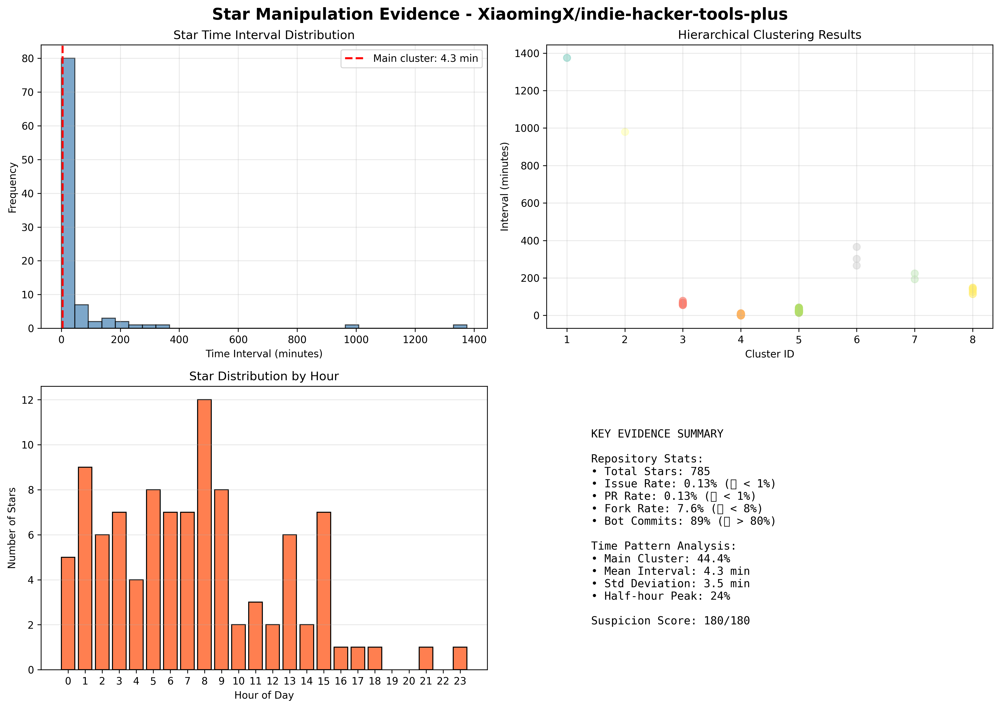

# 分析报告 - XiaomingX/indie-hacker-tools-plus

> **生成时间**: 2025-12-15 19:11:45

---

## 🎯 最终判决

### 可疑度评分: **180/180**

### 判定结果: **🔴 CONFIRMED MANIPULATION**

### 置信度: **极高**

---

## 📊 基础数据

| 指标 | 数值 | 状态 |
|------|------|------|
| Stars | 785 | - |
| Forks | 60 (7.6%) | 🔴 |
| Issues | 1 (0.13%) | 🔴 |
| PRs | 1 (0.13%) | 🔴 |
| Bot Commits | 89% | 🔴 |

---

## 🔍 证据详情

### 1. Issue率分析 (30 分)

- **实际值**: 0.13%
- **正常值**: >2%
- **判定**: 🔴 异常 - Issue率过低

**说明**: Issue率<1%说明用户只收藏不使用，典型的虚假star特征。

### 2. PR率分析 (20 分)

- **实际值**: 0.13%
- **正常值**: >2%
- **判定**: 🔴 异常 - PR率过低

**说明**: 几乎无PR说明项目无人贡献，缺乏真实用户参与。

### 3. Fork率分析 (25 分)

- **实际值**: 7.6%
- **正常值**: >8%
- **判定**: 🔴 异常 - Fork率过低

**说明**: Fork率<8%说明用户不实际使用项目，只是收藏。

### 4. Bot提交分析 (30 分)

- **实际值**: 89%
- **正常值**: <20%
- **判定**: 🔴 严重异常 - Bot刷活跃度

**说明**: Bot提交占比>80%，明显用于刷活跃度和trending排名。

### 5. 时间聚类分析 (50 分) ⭐ 核心证据

- **主簇大小**: 44 样本 (44.4%)
- **平均间隔**: 4.3 分钟
- **标准差**: 3.5 分钟
- **判定**: 🔴 极度异常 - 程序自动化

**关键发现**: 标准差<5分钟，44%的star高度集中！这在统计学上不可能是人类行为，明确指向程序自动化控制。

### 6. 批量创建分析 (25 分)

- **判定**: 🔴 异常 - 发现批量创建

---

## 🎯 最终结论

### ⚠️  确认存在Star操纵行为

基于多维度证据分析，该仓库存在**明确的Star操纵行为**。

#### 建议:
- 可向GitHub Support举报
- 提供本分析报告作为证据

---

**生成工具**: https://github.com/zly2006/fake-star-detector# v2.0  
**分析时间**: 2025-12-15 19:11:45  
**报告格式**: Markdown

---

## 📎 附件

- 详细数据: `report_XiaomingX_indie-hacker-tools-plus.json`
- 可视化图表: 
